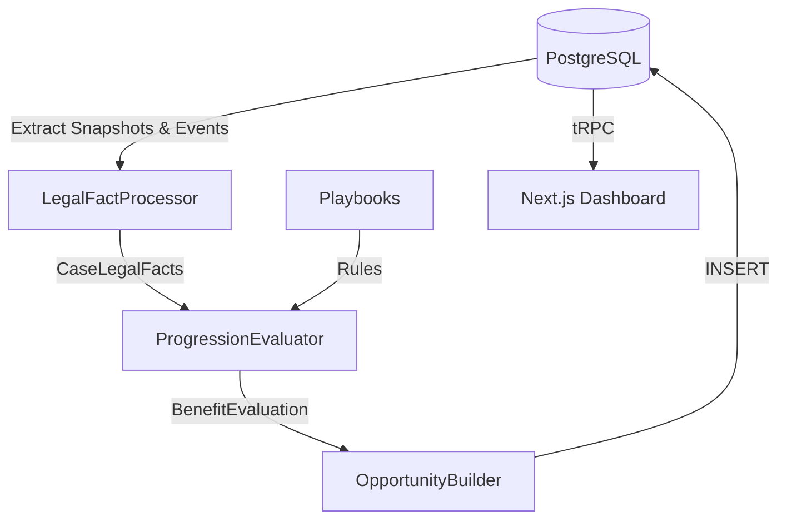

# EXECFLOW: Architecture

## Core Philosophy
The EXECFLOW architecture strictly separates **Legal Facts** (Inputs), **Legal Rules** (Playbooks), and **Procedural Outcomes** (Opportunities & Deadlines). The engine is purely functional, side-effect-free during evaluation, and deterministic.

## System Topology
1. **Frontend (`apps/web`)**: Next.js App Router providing a workspace for lawyers. Connects to backend via tRPC.
2. **Backend API (`apps/api`)**: Hono-based REST/tRPC API deployed on Node. Secure endpoints for dashboard data (opportunities, timelines).
3. **Queue Workers (`packages/workers`)**: `pg-boss` based background jobs. They listen for `engine.evaluation.requested` events, instantiate the engine, and commit the results.
4. **Execution Engine (`packages/engine`)**: Pure TypeScript library handling the evaluation logic.
5. **Database (`packages/db`)**: PostgreSQL managed via Drizzle ORM. Strictly tenant-isolated.

## The MVP Evaluation Pipeline (E2E)

## Storage & Audit
- **Append-only evaluations**: Evaluation outcomes and generated opportunities are stored immutably.
- **Human Gating**: Opportunities transition states (`suggested` → `qualified` → `realized`) strictly via explicit human actions recorded in `opportunity_reviews`.
