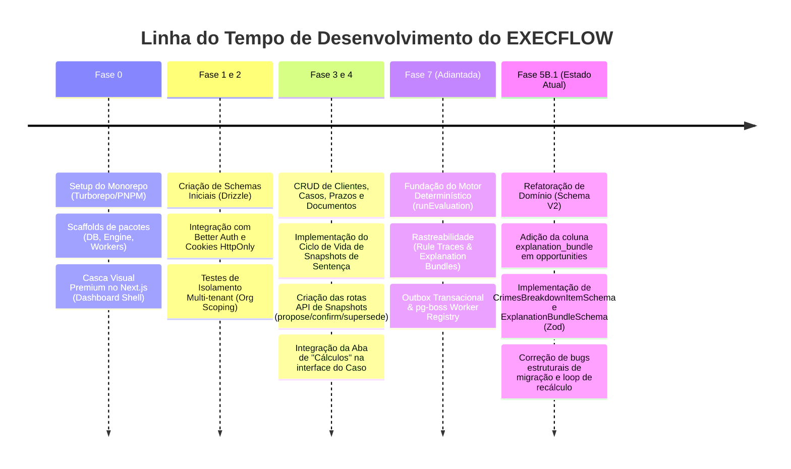

# Auditoria de Recuperação de Contexto — EXECFLOW

Este documento representa uma auditoria profunda do estado arquitetural e de desenvolvimento do **EXECFLOW**, consolidando informações do Masterplan (`EXECFLOW_MASTER_CONTEXT.md`), Handoff (`EXECFLOW_ANTIGRAVITY_HANDOFF.md`), planos de fase, códigos-fonte e migrações do banco de dados.

---

## 1. Em qual fase REAL estamos hoje?
Estamos na **Fase 5B.1 (Refatoração de Domínio & Schema V2)**. 
Toda a fundação visual (Phases 1–2 do Handoff), as APIs básicas de CRUD (Phase 3), a infraestrutura do motor de cálculo determinístico com commits transacionais (Phase 7) e a gestão de ciclo de vida de Snapshots de Sentença com a aba "Cálculos" na interface (Fase 4A) já foram implementadas no repositório. O foco agora é refatorar o banco de dados e as validações para preparar o motor para a matemática avançada da LEP.

---

## 2. Quais fases já foram efetivamente implementadas?
- **Fase 0 (Foundations) & Fase 1 (Data Layer):** Estrutura do monorepo (Turborepo + PNPM), banco de dados com Drizzle ORM integrado ao PostgreSQL local e Neon, e tabelas de isolamento básico.
- **Fase 2 (Auth Layer):** Integração com Better Auth via cookies HttpOnly segregados do domínio.
- **Fase 3 (Core APIs):** CRUD de Clientes, Execuções (Casos), Prazos e Oportunidades. Ingestão e upload de documentos.
- **Fase 4A (Snapshot Lifecycle):** Rotas de criação de Snapshots de Sentença (`sentence_snapshots`), mutações de confirmação (`confirm`) e supersessão (`supersede`), e interface interativa na aba de "Cálculos" no frontend Next.js.
- **Fase 7 (Core Engine Foundation):** Pipeline de Engine Runs, traces de regras, outbox pattern transacional e persistência de justificativas legais (`explanation_bundles`).

---

## 3. Quais fases foram apenas planejadas?
- **Fase 5B.2+ (LEP Math & Evaluators):** Implementação real de frações LEP complexas (16%, 20%, etc.) e as lógicas de reincidência e hediondez no motor.
- **Fase 6 (Queue Engine & Workflow Tasks):** Mecanismos de distribuição e atribuição de tarefas a usuários e controle fino de SLAs em workers assíncronos.
- **Fase 8 (AI Agents Integration):** Integração de agentes de OCR para extração inteligente e assistente de minutas de peças processuais.
- **Fase 9 (Analytics & Admin Tooling):** Relatórios de compliance de prazos, taxas de detecção de oportunidades e analytics de performance do escritório.

---

## 4. Decisões arquitetônicas APROVADAS (Sem rediscussão)
- **Monorepo com PNPM e Turborepo:** Divisão rígida entre `apps/api` (Hono), `apps/web` (Next.js), `packages/db` (Drizzle), `packages/engine` (Motor) e `packages/workers` (pg-boss).
- **Substituição do Prisma pelo Drizzle ORM:** Adotado para dar suporte nativo a queries temporais complexas e controle fino de tipos PostgreSQL.
- **Modelo de Auditoria Append-Only:** Tabelas críticas de histórico legal (logs de auditoria, eventos de domínio, snapshots, revisões) nunca sofrem `UPDATE` ou `DELETE`. Correções de cálculos ocorrem por cadeias de emenda (`amends_snapshot_id`).
- **Princípio dos Dois Relógios (Two-Clocks):** Distinção clara e obrigatória entre o Tempo Legal (`effective_at` / quando o fato ocorreu no mundo jurídico) e o Tempo de Sistema (`recorded_at` / quando o sistema registrou o fato).
- **Isolamento de Tenant (Org Scoping):** Todas as tabelas de domínio possuem `organization_id` obrigatório. O middleware da API barra qualquer tráfego que não esteja escopado à organização ativa do usuário.
- **Autoridade Humana / Non-Binding AI:** O motor ou a IA apenas propõem oportunidades e prazos (gerados como `suggested`/`open`). Nenhuma ação jurídica é executada ou qualificada sem a intervenção explícita de um advogado (`requireMinRole('lawyer')`).

---

## 5. Decisões arquitetônicas ainda ABERTAS
- **Semântica de Estados de Oportunidades:** Se os estados `blocked` e `abandoned` definidos no documento de arquitetura devem ser adicionados na máquina de estados física (`VALID_TRANSITIONS` em `opportunity.ts`), que hoje só suporta `suggested`, `qualified`, `pursuing`, `realized`, `dismissed` e `expired`.
- **Nomenclatura do Estado Inicial do Caso:** O código inicializa casos com `status: 'intake'`, enquanto as especificações de arquitetura propõem `status: 'draft'`.
- **Implementação do Snooze de Fila:** A coluna `snoozed_until` existe em `queue_projections`, mas a lógica e as rotas de suspensão temporária de prazos/oportunidades não foram especificadas nem programadas.

---

## 6. Próximo passo exato do roadmap
A conclusão da **Fase 5B.1 (Refatoração de Domínio & Schema V2)**, que consiste em:
1. Adicionar o campo JSONB `explanationBundle` diretamente na tabela `opportunities` do banco de dados via Drizzle, permitindo leitura rápida e direta sem joins complexos para listagens simples no frontend.
2. Definir e exportar os schemas de validação Zod no pacote `@execflow/db` (`CrimesBreakdownItemSchema` e `ExplanationBundleSchema`).
3. Gerar e aplicar a migração de banco local de forma não destrutiva.
4. Resolver os bugs críticos de infraestrutura (triggers na migração 0004 e tipo JSONB de `is_replay` na migração 0006) e consertar o loop de recálculo assíncrono.

---

## 7. Dependências prévias para a Fase 5B
Antes de começar a escrever as regras matemáticas de cálculo penal da Fase 5B, as seguintes correções de infraestrutura são obrigatórias:
- **Correção da Migração 0004:** O trigger da tabela tenta chamar `update_updated_at_column()`, mas a função criada na migração 0001 chama-se `set_updated_at()`. Isso causa falha síncrona na aplicação das migrações do zero.
- **Correção do Tipo `is_replay` (0006):** O banco de dados define a coluna como `JSONB`, enquanto as tipagens do Drizzle e o código a tratam como `Boolean`. A comparação de tipos PostgreSQL causará falhas silenciosas na detecção de replay de motor.
- **Correção da constraint NULL de `deadline_history`:** O sweep de overdue tenta salvar registros de histórico de prazos com `changedByUserId: null`, mas a coluna foi criada na migração 0004 com a restrição `NOT NULL`.
- **Reparação do Loop de Recálculo:** A função `scheduleRecalculation` deve emitir o evento `engine.evaluation.requested` na mesma transação que escreve na tabela `recalculation_runs`. Atualmente, ela apenas grava a linha no banco, e nenhuma fila de pg-boss dispara a execução física do motor, deixando os recálculos presos para sempre em `status='scheduled'`.

---

## 8. Modelos Definitivos Aprovados

### A. SentenceSnapshot V2
O modelo estende o snapshot clássico de sentenças de dias de pena agregados para conter a quebra individualizada de crimes.
- `crimesBreakdown`: Coluna JSONB contendo um array de objetos `CrimeBreakdown` (§8.B). Padrão: `[]`.
- `isGenericRecidivist`: Coluna Boolean. Padrão: `false` (afeta frações de crimes comuns sob a LEP de 1984/Pacote Anticrime de 2019).
- `percentServed`: `@deprecated` (marcado em JSDoc). Não deve ser usado pelo motor novo, pois o motor processará cada crime individualmente.

### B. CrimesBreakdown
Cada objeto no array `crimesBreakdown` deve possuir exatamente os campos:
```typescript
{
  crimeCode: string,         // Código interno do tipo penal
  crimeName: string,         // Nome legível (ex: "Tráfico de Drogas")
  article: string,           // Artigo da lei (ex: "Art. 33")
  law: string,               // Lei correspondente (ex: "Lei 11.343/06")
  sentenceDays: number,      // Tamanho da pena deste crime em dias
  isHediondo: boolean,       // Classificação como Hediondo
  isEquiparado: boolean,     // Equiparado a hediondo (ex: tráfico, tortura)
  hasResultingDeath: boolean, // Se o crime resultou em morte
  isAttempted: boolean,      // Se o crime foi tentado ou consumado
  sentenceDate: string,      // Data da sentença (ISO String)
  transitDate: string        // Trânsito em julgado para a acusação (ISO String)
}
```

### C. LegalFactProcessor (Event Effect Processor)
Componente conceitual do motor responsável por avaliar o log de eventos do caso (`TimelineEvent[]`) e os snapshots consolidados para gerar os fatos de caso (`CaseFacts`) livres de efeitos colaterais. Ele processa eventos como faltas graves, progressões, saídas e fugas para deduzir interrupções ativas de prazo e marcos temporais (marcos de base de cálculo).

### D. ExplanationBundle
JSON estruturado armazenado em `payload` na tabela `explanation_bundles` (ou no campo da oportunidade):
```typescript
{
  summary: string,
  conclusionType: 'opportunity' | 'deadline' | 'warning' | 'snapshot_proposal',
  playbookVersion: {
    id: string,
    label: string,
    effectiveFrom: string
  },
  legalRulesApplied: Array<{
    ruleId: string,
    playbookVersionId: string,
    branchId: string | null,
    citationRef: string,
    parameters: Record<string, unknown>
  }>,
  calculations: Array<{
    name: string,
    inputs: Record<string, unknown>,
    output: unknown,
    confidence: 'high' | 'medium' | 'low' | 'unknown' | 'blocked',
    derivationNote: string
  }>,
  sourceDocuments: Array<{
    documentId: string,
    fieldPaths: string[],
    spans?: string[]
  }>,
  sourceEvents: Array<{
    timelineEventId: string,
    eventType: string
  }>,
  missingData: Array<{
    field: string,
    whyNeeded: string,
    severity: 'critical' | 'recommended' | 'optional'
  }>,
  uncertaintyIndicators: Array<{
    code: string,
    message: string,
    affectedOutputs: string[]
  }>,
  blockingCodes: string[],
  alternatives: Array<{
    interpretationId: string,
    label: string,
    outcome: string,
    branchId: string
  }>
}
```

### E. Opportunity
Armazena a hipótese de benefício.
- **Campos de Controle:** `requiresReview`, `isPendingReview`, `isBlocked`, `isStale`.
- **Novidade V2:** A coluna `explanationBundle` (JSONB) conterá o payload do bundle de justificativa (§8.D) embutido, evitando joins complexos no feed do dashboard.
- **Ciclo de vida:** `suggested → qualified → pursuing → realized` (ou `dismissed`/`expired`).

### F. Deadline
- **Tabela:** `deadlines` mapeia o estado atual (`open`, `acknowledged`, `completed`, `dismissed`, `overdue`).
- **Histórico:** `deadline_history` rastreia alterações do prazo de forma puramente append-only.
- **Origem:** `Deadline.origin` diferencia se o prazo foi gerado automaticamente por regras do motor (`rule`) ou manualmente por advogados (`manual`).

### G. Engine Evaluation Result
Retornado por `runEvaluation` (no motor) antes de ser persistido no banco pelo commit:
- `runId` (UUID) e `evaluatedAt` (Timestamp)
- `overallConfidence` e `overallUncertaintyLevel`
- `ruleTraces`: Array detalhando o resultado de cada regra avaliada (inclusão de hashes de inputs/outputs para replay).
- `opportunityProposals`: Array de novas oportunidades sugeridas, contendo o `ExplanationBundle` embutido.
- `warnings` e `dependencies` (snapshots e eventos consumidos que afetam a reavaliação futura).

---

## 9. Inconsistências Identificadas

| Área | Documentação / Especificação | Código / Implementação | Gravidade | Resolução |
|------|------------------------------|-----------------------|-----------|-----------|
| **Estados de Oportunidades** | `event-state-architecture.md` cita estados `blocked` e `abandoned`. | Apenas `dismissed` e `expired` são aceitos em `VALID_TRANSITIONS`. | Média | Adicionar os estados na máquina ou atualizar a documentação. |
| **Nomenclatura do Caso** | O caso começa no estado `draft` no Masterplan. | O seed e o repositório criam casos com status `intake`. | Média | Padronizar spec ou código para o mesmo termo. |
| **Snooze de Prazos** | A especificação prevê adiamento (`snoozed`) de prazos e filas. | Não há rota, mutation ou lógica de snooze nos serviços. | Baixa | Implementar a lógica ou atualizar a documentação removendo o snooze. |
| **Replay Playbook Parameter** | `point-in-time.ts` promete respeitar a flag `useHistoricalPlaybook`. | O parâmetro é aceito mas ignorado. O resolver de playbooks já usa a data da avaliação de qualquer forma. | Baixa | Limpar a assinatura da função para evitar promessas de controle que não existem. |
| **Trigger de Migração 0004** | A migração assume que a função `update_updated_at_column()` está presente. | A migração 0001 criou a função com o nome de `set_updated_at()`. | **Altíssima** | Corrigir a chamada de trigger no arquivo SQL da migração 0004. |
| **Tipo de Dado `is_replay`** | Drizzle schema e API tratam a flag como `Boolean`. | A migração 0006 cria a coluna `engine_runs.is_replay` como tipo `JSONB`. | **Altíssima** | Ajustar o tipo da coluna na migração 0006 para `BOOLEAN NOT NULL DEFAULT FALSE`. |
| **Deadlines Overdue Sweep** | O sweep assíncrono envia `changedByUserId: null` ao salvar histórico. | A tabela `deadline_history` obriga que `changed_by_user_id` seja `NOT NULL`. | **Altíssima** | Alterar a migração/schema de `deadline_history` para aceitar `null` no autor quando for o sistema. |
| **Workflow Task URL** | JSDoc no controller aponta rotas sob `/api/v1/workflow-tasks/...`. | A API monta a rota sob `/api/v1/queue-projections/workflow-tasks/...`. | Média | Corrigir o comentário ou criar um alias de rota no Hono. |

---

## 10. Linha do Tempo do Projeto


