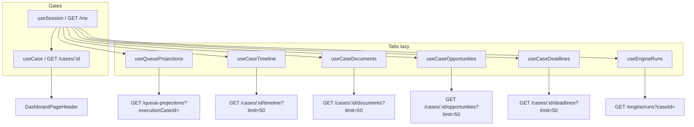

# Case Workspace — Especificação Visual Completa

**Data:** 2026-05-27  
**Objetivo:** Blueprint para reconstrução visual no Antigravity  
**Fonte:** Frontend implementado em `apps/web` (read-only MVP)  
**Restrições deste documento:** Sem novas funcionalidades · Sem novos endpoints · Apenas o que existe hoje

**Rota:** `/cases/[caseId]`  
**Layout pai:** `(app)/layout.tsx` → `DashboardLayout`

---

## 1. Estrutura da página

A página Case Workspace é um **client component** monolítico com estado local de tab. Não possui sub-rotas nem query params. A composição vertical, de cima para baixo, é:

```
DashboardLayout (shell global)
└── main > content panel (max-w 1280px, padding responsivo)
    └── CaseWorkspacePage
        ├── [Gate] Sessão
        ├── [Gate] caseId válido
        ├── [Gate] Detalhe do caso (header API)
        ├── DashboardPageHeader (identidade do caso)
        ├── CaseTabBar (6 tabs)
        └── Tab panel activo (1 de 6)
            └── LoadingState | OperationalErrorState | EmptyState | Lista de cards
```

### Camadas de renderização (sequência lógica)

| Ordem | Camada | Condição | O que ocupa o viewport |
|-------|--------|----------|------------------------|
| 1 | Sessão loading | `sessionLoading` | `LoadingState` — «Carregando sessão…» |
| 2 | Sessão inválida | `session === null` | `OperationalErrorState` — sem retry |
| 3 | ID inválido | `caseId === ''` | `OperationalErrorState` — sem retry |
| 4 | Caso loading | `caseQuery.isLoading` | `LoadingState` — «Carregando caso…» (header + tabs ocultos) |
| 5 | Caso error | `caseQuery.isError` | `OperationalErrorState` + retry (header + tabs ocultos) |
| 6 | Caso OK | sucesso | Header + TabBar + conteúdo da tab activa |

**Nota:** Enquanto o caso carrega ou falha, **não** se mostra header nem tabs. Apenas após `GET /cases/:id` bem-sucedido é que a estrutura completa aparece.

### Estado da tab

- **Default:** `trabalho`
- **Persistência:** nenhuma (refresh volta a Trabalho; URL não reflecte tab activa)
- **Fetch:** lazy — cada hook só corre quando `activeTab` corresponde

---

## 2. Componentes utilizados

### Shell (herdado, não específico do Case Workspace)

| Componente | Ficheiro | Função |
|------------|----------|--------|
| `DashboardLayout` | `components/dashboard/DashboardLayout.tsx` | Canvas escuro, sidebar fixa, painel principal scrollável |
| `Sidebar` | `components/dashboard/Sidebar.tsx` | Nav global; mobile drawer 260px |
| `(app)/layout.tsx` | `app/(app)/layout.tsx` | Wrap automático em `DashboardLayout` |

### Case Workspace (específicos ou partilhados)

| Componente | Origem | Uso na página |
|------------|--------|---------------|
| `DashboardPageHeader` | `components/dashboard/DashboardPageHeader.tsx` | Eyebrow + título + descrição do caso |
| `CaseTabBar` | `components/case-workspace/CaseTabBar.tsx` | Navegação entre 6 secções |
| `LoadingState` | `components/operational/loading-state.tsx` | Spinner + label textual |
| `EmptyState` | `components/operational/empty-state.tsx` | Ícone caixa + título + descrição centrados |
| `OperationalErrorState` | `components/operational/error-boundary.tsx` | Alerta vermelho + mensagem mono + botão retry |
| Tab panels inline | `[caseId]/page.tsx` | `TrabalhoTab`, `TimelineTab`, etc. — listas `<ul>` + cards `<li>` |

### Tokens de design (inline Tailwind via imports)

| Token | Valores |
|-------|---------|
| `surfaces.canvas` | `#09090b` |
| `surfaces.main` | `#0a0a0c` |
| `surfaces.panelMuted` | `#0e0e10` (wrapper da página) |
| `surfaces.panel` | `#111113` (cards de lista) |
| `surfaces.panelInset` | `#0d0d0f` (tab bar, empty state) |
| `borders.subtle` | `border-white/[0.06]` |
| `text.primary` | `text-zinc-50` |
| `text.secondary` | `text-zinc-400` |
| `text.muted` | `text-zinc-500` |
| `text.faint` | `text-zinc-600` |

### Labels partilhados

| Mapa | Ficheiro | Consumido em |
|------|----------|--------------|
| `QUEUE_TYPE_LABELS` | `lib/operational/queue-display.ts` | Tab Trabalho |
| `PRIORITY_LABELS` | idem | Tab Trabalho (badges coloridos) |
| `OPPORTUNITY_TYPE_LABELS` | idem | Tab Oportunidades |
| `DEADLINE_CLASS_LABELS` | idem | Tab Prazos |

---

## 3. Hierarquia visual

### Nível 0 — Shell

```
┌─────────────────────────────────────────────────────────────┐
│ SIDEBAR (260px, fixa)  │  MAIN (scroll)                     │
│ bg #0c0c0e             │  bg #0a0a0c                        │
│                        │  ┌─────────────────────────────┐   │
│  EXECFLOW brand        │  │ panelMuted #0e0e10          │   │
│  Nav sections          │  │ rounded-2xl border subtle   │   │
│  (Início, Execuções…)  │  │ p-4..p-6                    │   │
│                        │  │   [CASE WORKSPACE CONTENT]  │   │
│                        │  └─────────────────────────────┘   │
└─────────────────────────────────────────────────────────────┘
```

Mobile: sidebar oculta; header fixo 56px com hamburger; `main` com `pt-14`.

### Nível 1 — Header do caso (`DashboardPageHeader`)

| Elemento | Tipografia | Cor | Conteúdo |
|----------|------------|-----|----------|
| Eyebrow | 11px, uppercase, tracking 0.14em, medium | `text.muted` | Fixo: «Execução penal» |
| Title (h1) | 28–32px, semibold, tracking -0.02em | `text-zinc-50` | `clientSummary.displayName` → `fullName` → fallback «Execução penal» |
| Description | 13px, leading relaxed, max-w-2xl | `text.secondary` | Metadados unidos por ` · ` |

**Campos na descrição (ordem fixa quando disponíveis):**

1. `Ref. {internalRef}`
2. `Processo {executionProcessNumber}` ou «Processo pendente»
3. `{courtName}` (se não null)
4. `{courtJurisdiction}` (se não null)
5. `Status: {status}` (string API raw)
6. `Aberto em {openedAt}` (formato pt-BR dd/mm/aaaa)

Separador visual: `border-b subtle pb-6 mb-6` abaixo do header.

### Nível 2 — Tab bar (`CaseTabBar`)

| Propriedade | Valor |
|-------------|-------|
| Container | `rounded-xl`, border subtle, `panelInset`, `p-1`, `mb-5`, scroll horizontal |
| Tab activa | `bg-white/[0.07]`, `text.primary`, inset shadow 1px |
| Tab inactiva | `text.faint`, hover `text-zinc-400` |
| Tab label | 12px, font-medium, `px-3 py-1.5`, `rounded-lg` |
| A11y | `role="tablist"`, tabs com `role="tab"`, `aria-selected` |

Ordem das tabs: **Trabalho → Timeline → Documentos → Oportunidades → Prazos → Motor**

### Nível 3 — Conteúdo da tab (padrão comum)

Três variantes de conteúdo, mutuamente exclusivas:

1. **Loading** — linha horizontal: spinner 16px + label 13px muted
2. **Error** — card inset com título vermelho «Não foi possível carregar», mensagem mono, link «Tentar novamente»
3. **Empty** — card centrado 12py, ícone circular, título 14px, descrição 13px faint
4. **Lista** — `<ul class="space-y-2">` de cards `rounded-xl border panel px-4 py-3`

**Card pattern (lista):**

- Badge superior (10px uppercase, border, tracking largo) — variável por tab
- Metadados secundários (11px faint)
- Título/corpo (13px secondary ou medium)
- Metadados terciários (11–12px faint)

---

## 4. Estados loading

| Contexto | Componente | Label exacto | Retry |
|----------|------------|--------------|-------|
| Sessão | `LoadingState` | «Carregando sessão…» | — |
| Detalhe do caso | `LoadingState` | «Carregando caso…» | — |
| Tab Trabalho | `LoadingState` | «Carregando trabalho…» | — |
| Tab Timeline | `LoadingState` | «Carregando timeline…» | — |
| Tab Documentos | `LoadingState` | «Carregando peças…» | — |
| Tab Oportunidades | `LoadingState` | «Carregando oportunidades…» | — |
| Tab Prazos | `LoadingState` | «Carregando prazos…» | — |
| Tab Motor | `LoadingState` | «Carregando avaliações…» | — |

**Comportamento visual:** Spinner CSS (`animate-spin`, border 2px, topo zinc-400). Sem skeleton rows. Sem placeholder data.

**Comportamento de fetch:** Tab inactiva não dispara request (`enabled: false` nos hooks). Ao mudar de tab, loading aparece na área de conteúdo **abaixo** do header e tab bar (header permanece visível).

---

## 5. Estados empty

| Tab | Título | Descrição |
|-----|--------|-----------|
| Trabalho | «Nenhum item pendente» | «Não há trabalho activo neste caso no momento.» |
| Timeline | «Nenhum evento registado» | «A linha temporal deste caso aparecerá aqui.» |
| Documentos | «Nenhuma peça associada» | «Documentos associados a este caso aparecerão aqui.» |
| Oportunidades | «Nenhuma oportunidade» | «Oportunidades detectadas para este caso aparecerão aqui.» |
| Prazos | «Nenhum prazo activo» | «Prazos associados a este caso aparecerão aqui.» |
| Motor | «Nenhuma avaliação» | «Execuções do motor de cálculo para este caso aparecerão aqui.» |

**Visual `EmptyState`:** Container `panelInset`, border subtle, padding vertical 48px, ícone SVG documento vazio 40×40, texto centrado. Prop `action` existe no componente mas **não é usada** em nenhuma tab.

---

## 6. Estados error

| Contexto | Mensagem default | Retry |
|----------|------------------|-------|
| Sessão null | «Sessão não encontrada. Faça login novamente.» | Não |
| caseId inválido | «Identificador de caso inválido.» | Não |
| Caso API | `error.message` ou «Erro ao carregar caso.» | Sim → `caseQuery.refetch()` |
| Tab Trabalho | `error.message` ou «Erro ao carregar trabalho.» | Sim |
| Tab Timeline | «Erro ao carregar timeline.» | Sim |
| Tab Documentos | «Erro ao carregar peças.» | Sim |
| Tab Oportunidades | «Erro ao carregar oportunidades.» | Sim |
| Tab Prazos | «Erro ao carregar prazos.» | Sim |
| Tab Motor | «Erro ao carregar avaliações.» | Sim |

**Visual `OperationalErrorState`:** Título fixo «Não foi possível carregar» em `text-red-400` 14px; corpo em mono 13px muted; botão texto sublinhado «Tentar novamente».

**RBAC:** Erros 403/404 da API propagam mensagem do servidor via `ApiError.message`. UI não distingue visualmente tipos de erro (403 vs 404 vs 500).

---

## 7. Navegação

### Entrada na página

| Origem | Mecanismo | Condição |
|--------|-----------|----------|
| `/queues` | `<Link href="/cases/{executionCaseId}">` | `item.executionCaseId !== null` |
| URL directa | `/cases/[uuid]` | Cookie de sessão (middleware) |
| Sidebar «Execuções» | `/cases` | **Não** leva ao workspace — lista stub, sem link para `[caseId]` |

### Saída / contexto

| Acção | Existe? |
|-------|---------|
| Breadcrumb «Fila → Caso» | Não |
| Botão voltar | Não (browser back) |
| Highlight sidebar para caso activo | Não (`/cases/[id]` não match `/cases` exacto) |
| Deep link para tab | Não |
| Link de cards Trabalho para entidade | Não |

### Hover em `/queues` (referência visual para cards linkáveis)

Cards com caso: `hover:bg-white/[0.02]`, cursor pointer implícito via `<Link>`. No Case Workspace, cards **não** são linkáveis.

---

## 8. Dependências de dados

### Diagrama de dependências



### Parâmetros comuns

| Hook | `organizationId` | `caseId` | `enabled` | Outros params |
|------|-------------------|----------|-----------|---------------|
| `useSession` | — | — | sempre | — |
| `useCase` | org da sessão | URL param | session OK + caseId | — |
| `useQueueProjections` | org | URL param | tab = trabalho | `limit: 50`, `executionCaseId` |
| `useCaseTimeline` | org | URL param | tab = timeline | `limit: 50` |
| `useCaseDocuments` | org | URL param | tab = documentos | `limit: 50` |
| `useCaseOpportunities` | org | URL param | tab = oportunidades | `limit: 50` |
| `useCaseDeadlines` | org | URL param | tab = prazos | `limit: 50` |
| `useEngineRuns` | org | URL param | tab = motor | `caseId` query |

**Headers API:** Todas as chamadas org-scoped passam `organizationId` via `apiGet` (cookie auth + org header).

**Paginação:** API devolve `nextCursor`; UI **ignora** — mostra no máximo 50 itens sem indicador «há mais».

**Stale times:** caso 60s; tabs 30s; sessão 2min.

---

## 9. Especificação por tab

---

### Tab: Trabalho (default)

#### Dados consumidos

**Endpoint:** `GET /api/v1/queue-projections?executionCaseId={caseId}&limit=50`

**Tipo:** `QueueProjectionItem[]`

| Campo usado na UI | Campo ignorado (existe na API) |
|-------------------|-------------------------------|
| `id` (key) | `organizationId`, `entityType`, `entityId` |
| `priority` → badge colorido | `status`, `assigneeUserId` |
| `queueType` → label PT | `displayLabel`, `keyDate` |
| `displayTitle` | `metadata`, `sourceCausingEventId` |
| `slaDeadlineAt` (opcional) | `snoozedUntil`, `createdAt`, `updatedAt` |

#### Componentes renderizados

1. Contador: «N itens pendentes» (12px faint)
2. Lista `<ul aria-label="Trabalho pendente">`
3. Por item — card horizontal:
   - Badge prioridade (`PRIORITY_LABELS`: Urgente/Alta/Média/Normal + cores semânticas)
   - Label tipo fila (`QUEUE_TYPE_LABELS`)
   - Título `displayTitle` (13px medium secondary)
   - Linha «Prazo: dd/mm/aaaa» se `slaDeadlineAt !== null`

#### Interações existentes

| Interacção | Comportamento |
|------------|---------------|
| Tab já activa ao load | Sim |
| Scroll lista | Sim (nativo) |
| Retry em erro | Sim |

#### Interações ausentes (vs `/queues`)

| Interacção | Estado |
|------------|--------|
| Click no card | Não navega |
| Filtro por tipo de fila | Não |
| Data de criação à direita | Não (presente em `/queues`) |
| Hover state | Não |
| Claim / snooze / resolve | Não |

---

### Tab: Timeline

#### Dados consumidos

**Endpoint:** `GET /api/v1/cases/:caseId/timeline?limit=50`

| Campo usado | Campo ignorado |
|-------------|----------------|
| `id` | `organizationId`, `executionCaseId` |
| `eventCategory` → badge | `payload` (JSON completo) |
| `visibility` (string raw) | `source`, `authorUserId`, `actorType`, `actorId` |
| `occurredAt` → datetime pt-BR | `recordedAt` |
| `summary` | — |
| `eventType` (string raw, linha inferior) | — |

#### Componentes renderizados

Por evento — card vertical:
- Row superior: badge categoria | visibility | datetime (ml-auto, tabular-nums)
- Corpo: `summary` 13px
- Rodapé: `eventType` 11px faint

Badge categoria: estilo neutro (`border-white/[0.08] bg-white/[0.04]`), **sem** mapa de labels PT.

#### Interações existentes

| Interacção | Comportamento |
|------------|---------------|
| Mudança para tab | Dispara fetch |
| Retry | Sim |

#### Interações ausentes

| Interacção | Estado |
|------------|--------|
| Expandir `payload` | Não |
| Filtro por categoria/visibility | Não |
| Ordenação | Não (ordem API) |
| Paginação | Não |
| Link para autor | Não |

---

### Tab: Documentos

#### Dados consumidos

**Endpoint:** `GET /api/v1/cases/:caseId/documents?limit=50`

| Campo usado | Campo ignorado |
|-------------|----------------|
| `id` | `organizationId`, `clientId`, `executionCaseId` |
| `fileName` (título) | `mimeType`, `sensitivityLevel`, `sourceChannel` |
| `status`, `ocrStatus` (raw) | `uploadedByUserId`, `confirmedAt`, `confirmedByUserId` |
| `documentClass` (se não null) | `updatedAt` |
| `byteSize` → formatado B/KB/MB | — |
| `uploadedAt` → data pt-BR | — |

#### Componentes renderizados

Por documento — card simples:
- Título: `fileName` 13px medium
- Meta row flex wrap 11px: Status · OCR · Classe · Tamanho · Enviado {data}

#### Interações existentes

| Interacção | Comportamento |
|------------|---------------|
| Retry | Sim |
| Scroll lista | Sim |

#### Interações ausentes

| Interacção | Estado |
|------------|--------|
| Preview / download | Não |
| Click para detalhe | Não |
| Upload | Não |
| Review confirmação | Não |
| Ícone por mime type | Não |

---

### Tab: Oportunidades

#### Dados consumidos

**Endpoint:** `GET /api/v1/cases/:caseId/opportunities?limit=50`

| Campo usado | Campo ignorado |
|-------------|----------------|
| `id` | `organizationId`, `executionCaseId` |
| `opportunityType` → `OPPORTUNITY_TYPE_LABELS` | `detectedAt`, `qualifiedAt`, `qualifiedByUserId` |
| `status` (raw) | `windowStartAt`, `requiresReview`, `isPendingReview` |
| `confidenceLevel` (se não null) | `isBlocked`, `isStale`, `createdAt`, `updatedAt` |
| `summary` | — |
| `rationale` (line-clamp-2, se não null) | — |
| `windowEndAt` (se não null) | — |

#### Componentes renderizados

Por oportunidade — card:
- Badges row: tipo PT | status | confiança
- `summary` 13px
- `rationale` 12px faint, max 2 linhas
- «Janela até dd/mm/aaaa» se aplicável

#### Interações existentes

| Interacção | Comportamento |
|------------|---------------|
| Retry | Sim |

#### Interações ausentes

| Interacção | Estado |
|------------|--------|
| Aprovar / rejeitar | Não |
| Ver detalhe / histórico | Não |
| Indicadores `isBlocked` / `isStale` | Não renderizados |
| Link para fila `opportunity_review` | Não |

---

### Tab: Prazos

#### Dados consumidos

**Endpoint:** `GET /api/v1/cases/:caseId/deadlines?limit=50`

| Campo usado | Campo ignorado |
|-------------|----------------|
| `id` | `organizationId`, `executionCaseId` |
| `deadlineClass` → `DEADLINE_CLASS_LABELS` | `description`, `origin` |
| `status` (raw) | `assigneeUserId`, `acknowledgedAt`, `completedAt` |
| `priority` (raw string) | `dismissedAt`, `isBlocked`, `isStale` |
| `title` 13px medium | `createdAt`, `updatedAt` |
| `dueAt` → datetime pt-BR | — |

#### Componentes renderizados

Por prazo — card:
- Badges: classe PT | status | «Prioridade: {priority}»
- Título
- «Vencimento: dd/mm/aaaa, hh:mm»

#### Interações existentes

| Interacção | Comportamento |
|------------|---------------|
| Retry | Sim |

#### Interações ausentes

| Interacção | Estado |
|------------|--------|
| Marcar cumprido / dismiss | Não |
| Assignee | Não |
| Destaque visual por urgência | Não (sem cor por proximidade de vencimento) |
| `description` expand | Não |

---

### Tab: Motor

#### Dados consumidos

**Endpoint:** `GET /api/v1/engine/runs?caseId={caseId}`

| Campo usado | Campo ignorado |
|-------------|----------------|
| `id` | `organizationId`, `executionCaseId`, `playbookVersionId` |
| `trigger` → badge (raw) | `isReplay`, `completedAt`, `warningsEmitted` |
| `status` (raw) | `requestedByUserId` |
| `uncertaintyLevel` (se não null) | — |
| `evaluatedAt` (se não null) | — |
| `opportunitiesCreated.length` (se array) | conteúdo do array |
| `blockingCodes.join(', ')` (se length > 0) | — |

#### Componentes renderizados

Por run — card:
- Badges: trigger | status | incerteza
- «Avaliado em {datetime}»
- «Oportunidades criadas: N»
- «Bloqueios: code1, code2»

#### Interações existentes

| Interacção | Comportamento |
|------------|---------------|
| Retry | Sim |

#### Interações ausentes

| Interacção | Estado |
|------------|--------|
| Ver explanation bundle | Não (endpoint existe, UI não consome) |
| Ver rule trace | Não |
| Indicador replay (`isReplay`) | Não |
| Click para detalhe run | Não |
| Re-run / trigger manual | Não |

---

## 10. Mapa visual da tela

```
┌──────────┬──────────────────────────────────────────────────────────────────┐
│          │  ┌─ panelMuted container ─────────────────────────────────────┐  │
│ SIDEBAR  │  │                                                            │  │
│ 260px    │  │  EXECUÇÃO PENAL                          ← eyebrow 11px   │  │
│          │  │  João da Silva                           ← h1 28-32px     │  │
│ EXECFLOW │  │  Ref. EXE-2024-0042 · Processo pendente · TJSP ·          │  │
│          │  │  Status: active · Aberto em 15/01/2026   ← desc 13px      │  │
│ Início   │  │  ─────────────────────────────────────────────────────     │  │
│ Execuções│  │                                                            │  │
│ Clientes │  │  ┌─ CaseTabBar (panelInset) ────────────────────────────┐  │  │
│ …        │  │  │[Trabalho] Timeline  Documentos  Oportunidades …     │  │  │
│          │  │  └─────────────────────────────────────────────────────┘  │  │
│          │  │                                                            │  │
│          │  │  3 itens pendentes                         ← meta 12px     │  │
│          │  │  ┌─ card panel ──────────────────────────────────────┐   │  │
│          │  │  │ [URGENTE]  Revisão de extração                    │   │  │
│          │  │  │ Sentença — aguarda confirmação                    │   │  │
│          │  │  │ Prazo: 30/05/2026                                 │   │  │
│          │  │  └───────────────────────────────────────────────────┘   │  │
│          │  │  ┌─ card panel ──────────────────────────────────────┐   │  │
│          │  │  │ [ALTA]  Progressão                              │   │  │
│          │  │  │ …                                                 │   │  │
│          │  │  └───────────────────────────────────────────────────┘   │  │
│          │  │                                                            │  │
│          │  └────────────────────────────────────────────────────────────┘  │
└──────────┴──────────────────────────────────────────────────────────────────┘
```

**Proporções:**
- Content max-width: 1280px centrado
- Padding main: 16–32px horizontal; 20–28px vertical
- Gap entre cards: 8px (`space-y-2`)
- Card padding: 16px horizontal, 12px vertical

---

## 11. Wireframe textual

### WF-01 — Estado completo (caso carregado, tab Trabalho com dados)

```
[Sidebar global — inalterada]

[Header caso]
  eyebrow: "Execução penal"
  h1: {nome cliente}
  p: {ref · processo · tribunal · jurisdição · status · abertura}

[Tab bar]
  (•) Trabalho | Timeline | Documentos | Oportunidades | Prazos | Motor

[Área conteúdo]
  p.count: "{n} itens pendentes"
  repeat card:
    [badge prioridade colorida] [tipo fila]
    [displayTitle]
    optional: "Prazo: {data}"
```

### WF-02 — Loading inicial (caso)

```
[Sidebar]
[Spinner] Carregando caso…
(sem header, sem tabs)
```

### WF-03 — Loading tab (caso já visível)

```
[Header caso — visível]
[Tab bar — visível, tab X activa]
[Spinner] Carregando {tab}…
```

### WF-04 — Empty tab

```
[Header + Tab bar]
[EmptyState centrado]
  (ícone caixa)
  título contextual
  descrição contextual
```

### WF-05 — Error tab

```
[Header + Tab bar]
[Error card]
  "Não foi possível carregar"
  {mensagem API mono}
  [Tentar novamente]
```

### WF-06 — Tab Timeline (com dados)

```
repeat card:
  [eventCategory] [visibility]     {occurredAt datetime}
  {summary}
  {eventType}
```

### WF-07 — Tab Documentos

```
repeat card:
  {fileName}
  Status: · OCR: · Classe: · {size} · Enviado {date}
```

### WF-08 — Tab Oportunidades

```
repeat card:
  [tipo PT] [status] [confiança?]
  {summary}
  {rationale clamp 2}
  optional: Janela até {date}
```

### WF-09 — Tab Prazos

```
repeat card:
  [classe PT] [status] Prioridade: {priority}
  {title}
  Vencimento: {datetime}
```

### WF-10 — Tab Motor

```
repeat card:
  [trigger] [status] [incerteza?]
  Avaliado em {datetime}
  Oportunidades criadas: {n}
  Bloqueios: {codes}
```

---

## 12. Componentes reutilizáveis (para Antigravity)

Estes componentes **já existem** e devem ser mapeados 1:1 ou evoluídos como primitives no design system:

| Primitive Antigravity sugerido | Componente actual | Variantes necessárias |
|-------------------------------|-------------------|----------------------|
| `AppShell` | `DashboardLayout` | desktop / mobile drawer |
| `PageHeader` | `DashboardPageHeader` | com/sem eyebrow, com/sem description |
| `SegmentedTabs` | `CaseTabBar` | 6 items, scroll overflow |
| `SpinnerInline` | `LoadingState` | label customizável |
| `EmptyPanel` | `EmptyState` | com/sem action slot (vazio hoje) |
| `ErrorPanel` | `OperationalErrorState` | com/sem retry |
| `ListCard` | cards inline nas tabs | horizontal (Trabalho) vs vertical (resto) |
| `Badge` | badges de prioridade/tipo | priority semantic (4 níveis), neutral, uppercase micro |
| `MetaRow` | linhas 11px faint flex-wrap | — |

### Padrões visuais a preservar na migração

1. **Dark operational UI** — fundos quase pretos, borders 6–8% white, sem gradientes
2. **Tipografia utilitária** — escala 10/11/12/13/28px; uppercase só em badges/eyebrows
3. **Sem tabelas** — tudo é lista de cards empilhados
4. **Honestidade de estado** — loading explícito, empty honesto, sem skeleton fake
5. **Prioridade semântica** — vermelho/laranja/amarelo/zinc nos badges de fila

---

## 13. Componentes candidatos a redesign

Prioridade para o Antigravity — **mesmos dados, mesma interacção**, melhor execução visual:

| # | Componente actual | Problema visual | Redesign sugerido (sem funcionalidade nova) |
|---|-------------------|-----------------|---------------------------------------------|
| 1 | Tab panels inline (539 linhas) | Duplicação de 6× loading/empty/error/list | Extrair `CaseTabPanel` + `CaseListCard` como primitives |
| 2 | `CaseTabBar` | Clone de filter tabs de `/queues`; sem indicador de contagem | Unificar `SegmentedControl` partilhado; opcional dot se tab tem dados (dados já existem após visit) |
| 3 | Cards de lista | Todos visualmente iguais; hierarquia fraca | Variantes de densidade: `compact` (Trabalho) vs `detail` (Timeline, Oportunidades) |
| 4 | Badges neutros (Timeline, Motor) | `eventCategory`/`trigger` raw sem cor | Token set `badge.neutral` vs `badge.semantic` já mapeado em prioridades |
| 5 | `DashboardPageHeader` description | String longa numa linha com ` · ` | Layout em grid/chips para ref, processo, tribunal, status |
| 6 | Enum labels raw | `status`, `visibility`, `ocrStatus` em inglês técnico | Mapas PT **visuais only** (mesmos valores API, labels existentes em `queue-display.ts` como modelo) |
| 7 | Empty states | Mesmo ícone genérico para 6 contextos | Ícones distintos por domínio (trabalho, calendário, documento…) — mesma estrutura EmptyState |
| 8 | Trabalho vs `/queues` card | Inconsistência: falta data criação à direita | Alinhar layout horizontal com `/queues` (campo `createdAt` já existe na API) |
| 9 | Tab bar mobile | Só scroll horizontal | Indicador de overflow / fade edges |
| 10 | Error states | Mesmo visual para 403 e 500 | Variante visual por código HTTP (mensagem já vem da API) |

---

## 14. Recomendações — versão premium Antigravity

Objectivo: elevar percepção de qualidade **sem adicionar capacidades** — apenas melhorar legibilidade, consistência e craft visual com os mesmos endpoints e interacções.

### 14.1 Shell e layout

- Manter **sidebar + painel único** — modelo mental operacional já estabelecido
- Tornar header do caso **sticky** abaixo do shell mobile ao scroll (dados já carregados no header)
- Introduzir **breadcrumb mínimo** «Fila de trabalho › {nome}» como texto estático (navegação back já existe via browser; link para `/queues` reutiliza rota existente)

### 14.2 Tipografia e densidade

- Escalar tipográfica Antigravity: `--text-display` para h1 caso, `--text-caption` para 10–11px meta
- Aumentar contraste description header: chips separados em vez de string concatenada
- `tabular-nums` consistente em **todas** as datas (Trabalho usa só data; Prazos datetime)

### 14.3 Sistema de badges

- **Tier 1 — Semântico:** prioridade fila (4 cores existentes)
- **Tier 2 — Categórico:** opportunity type, deadline class (labels PT existentes)
- **Tier 3 — Neutro:** status API raw, visibility, trigger — monospace ou muted, sem cor

### 14.4 Listas e cards

- **Trabalho:** layout bicoluna como `/queues` (prioridade+título à esquerda, `createdAt` à direita — dado já disponível)
- **Timeline:** linha vertical conectada (estética timeline) — mesmos eventos, mesma ordem
- **Documentos:** ícone por `mimeType` (campo já na API) — decorativo, sem acção
- **Prazos:** peso visual proporcional a `dueAt` proximidade — cálculo client-side, sem regra de negócio nova
- **Motor:** badge «Replay» quando `isReplay === true` (campo já na API, hoje ignorado)

### 14.5 Estados

- Loading: manter spinner honesto; premium = micro-animação de entrada do conteúdo (fade-in) após load
- Empty: ilustrações por tab, mesmas strings actuais
- Error: preservar retry; premium = ícone distinct + separação visual do header

### 14.6 Tokens Antigravity (mapeamento)

| Token actual | Valor | Nota premium |
|--------------|-------|--------------|
| `surface.canvas` | `#09090b` | Base layer |
| `surface.panel` | `#111113` | Cards |
| `border.subtle` | white 6% | Considerar 8% em hover/focus |
| `text.primary` | zinc-50 | — |
| Priority urgent | red-400 on red-950/40 | Manter acessibilidade WCAG AA |

### 14.7 Consistência cross-page

- Unificar `CaseTabBar` e filter tabs de `/queues` num **único componente SegmentedControl**
- Unificar card de fila entre `/queues` e tab Trabalho (mesmos campos, mesmo hover só onde há link)
- Centralizar formatadores `formatDate`, `formatDateTime`, `formatBytes` (hoje inline na page)

### 14.8 Acessibilidade (premium baseline)

- Tab bar: navegação por teclado ←/→ entre tabs
- Listas: `aria-label` já presentes — manter
- Focus ring visível em tabs e retry (actualmente mínimo)
- Contraste badges amarelo (Média) sobre fundo escuro — rever no Antigravity

### 14.9 O que **não** incluir na versão premium (fora de scope)

- Upload, edição, criação, drag-and-drop
- Modais de review, claim, confirmação
- Paginação UI (mesmo que `nextCursor` exista)
- Gráficos, dashboards analíticos
- Novos endpoints ou painel cliente (`GET /clients/:id` não consumido hoje)
- Drill-down para documento / engine run / oportunidade

---

## 15. Checklist de paridade Antigravity

Ao reconstruir, verificar paridade funcional-visual com o MVP actual:

- [ ] Rota `/cases/[caseId]` com 6 tabs
- [ ] Default tab Trabalho
- [ ] Header com 6 segmentos de metadados do caso
- [ ] Lazy fetch por tab
- [ ] 8 labels de loading distinctos
- [ ] 6 empty states distinctos
- [ ] Retry em erro de caso + 6 tabs
- [ ] Entrada via link em `/queues` quando `executionCaseId` presente
- [ ] Limite 50 itens por lista sem paginação
- [ ] RBAC server-side inalterado (UI read-only)
- [ ] Mapas PT: queue type, priority, opportunity type, deadline class
- [ ] Campos raw exibidos: status, visibility, ocrStatus, trigger, eventType

---

## 16. Referências de código

| Artefacto | Caminho |
|-----------|---------|
| Página principal | `apps/web/src/app/(app)/cases/[caseId]/page.tsx` |
| Tab bar | `apps/web/src/components/case-workspace/CaseTabBar.tsx` |
| Layout app | `apps/web/src/app/(app)/layout.tsx` |
| Entry queues | `apps/web/src/app/(app)/queues/page.tsx` |
| Design tokens | `apps/web/src/components/dashboard/surfaces.ts` |
| Labels | `apps/web/src/lib/operational/queue-display.ts` |
| Relatório implementação | `docs/case-workspace-ui-report.md` |
| Contratos API | `docs/case-workspace-read-foundation-report.md` |

---

*Documento gerado para migração visual Antigravity. Reflecte exclusivamente o frontend implementado em 2026-05-27.*
