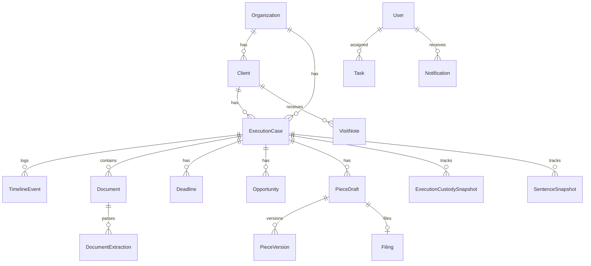

# EXECFLOW — Data Model v1 (Conceptual)

**Version:** 1.0 (conceptual)  
**Status:** Foundational entity architecture — **not** SQL, **not** Prisma.  
**Companions:** [`functional-architecture.md`](./functional-architecture.md), [`execution-workflows.md`](./execution-workflows.md).

**Purpose:** Lock the operational data model before database implementation so backend choices (tables, indexes, event stores, blob storage) align with *execução penal* practice at scale.

---

## Conventions

| Convention | Meaning |
|------------|---------|
| **Organization-scoped** | Every business entity includes `organization_id` unless noted (system-global reference data). |
| **UUID** | Primary keys are opaque UUIDs (implementation detail; assumed here). |
| **UTC storage** | All `*_at` timestamps stored in UTC; display in org timezone. |
| **Soft delete** | `deleted_at` nullable; record hidden from default queries, retained for legal traceability. |
| **Immutable** | Field or row cannot be updated after creation; corrections via new row or amendment link. |
| **Append-only** | Updates only by inserting new rows (history tables, timeline, audit). |
| **Confirmed** | Human-approved truth used by engines and drafting. |

### Tenancy and scope (foundational, not optional)

| Entity | Purpose |
|--------|---------|
| **Organization** | Law firm / legal team tenant. |
| **Membership** | Links `User` ↔ `Organization` with role (`admin`, `lawyer`, `assistant`). |

All listed core entities except reference catalogs (`PrisonUnit` may be shared or org-extended) live under an organization.

---

## 1. Core entities — catalog

High-level ownership graph:

```
Organization
├── User (via Membership)
├── Client
│     └── ExecutionCase (1..n)
│           ├── ExecutionCustodySnapshot* (append-only)
│           ├── SentenceSnapshot* (append-only)
│           ├── TimelineEvent* (append-only)
│           ├── Document (0..n)
│           ├── Deadline (0..n)
│           ├── Opportunity (0..n)
│           ├── PieceDraft (0..n) → PieceVersion* → Filing?
│           ├── VisitNote (0..n)
│           └── Task (0..n)
├── Document / Intake (may exist before Client link)
├── Notification
├── AIAnalysis
└── AuditLog (global stream)

* append-only or versioned child pattern
```

---

## 2. Entity definitions

### 2.1 User

| Aspect | Definition |
|--------|------------|
| **Purpose** | Authenticated human actor; attribution for legal and audit actions. |
| **Ownership** | Belongs to platform; linked to orgs via **Membership**. |

**Required fields**

| Field | Notes |
|-------|-------|
| `id` | PK |
| `email` | Unique login |
| `display_name` | |
| `status` | `active` \| `invited` \| `suspended` \| `deactivated` |
| `created_at` | |

**Optional fields**

| Field | Notes |
|-------|-------|
| `phone` | |
| `bar_number` | OAB or equivalent |
| `avatar_url` | |
| `last_login_at` | |

**Timestamps**

| Field | Mutable |
|-------|:-------:|
| `created_at` | No |
| `updated_at` | Yes |
| `deactivated_at` | Yes |

**Immutable:** `id`, `created_at`.  
**Soft delete:** Use `deactivated_at` + `status`; **never hard-delete** users with legal attribution history.

**Relationships**

| Relation | Cardinality |
|----------|-------------|
| Membership → Organization | N:M |
| Responsible lawyer on Client / ExecutionCase | 1:N (as FK on those entities) |
| Created/updated records | 1:N via audit |

**Lifecycle:** `invited` → `active` → `suspended` \| `deactivated`.

**Validation:** Email unique; deactivated users cannot approve pieces or dismiss critical deadlines.

---

### 2.2 Client

| Aspect | Definition |
|--------|------------|
| **Purpose** | Natural person supervised by the firm in penal execution matters. |
| **Ownership** | `organization_id`; **responsible_lawyer_user_id** (primary lawyer). |

**Required fields**

| Field | Notes |
|-------|-------|
| `id` | PK |
| `organization_id` | |
| `full_name` | Legal display name |
| `responsible_lawyer_user_id` | |
| `status` | `active` \| `inactive` \| `merged` |
| `created_at` | |
| `created_by_user_id` | |

**Optional fields**

| Field | Notes |
|-------|-------|
| `cpf` | **Sensitive** — unique per org when present |
| `internal_ref` | Firm reference if no CPF yet |
| `birth_date` | Sensitive |
| `aliases` | JSON array |
| `contact_channels` | Structured; sensitive |
| `notes` | Internal summary (not visit note) |
| `merged_into_client_id` | When `status=merged` |

**Timestamps:** `created_at`, `updated_at`, `deleted_at` (soft).

**Immutable:** `id`, `organization_id`, `created_at`, `created_by_user_id`.

**Soft delete:** Allowed; **never hard-delete** if any ExecutionCase, Document, or VisitNote exists.

**Relationships**

| Relation | Cardinality |
|----------|-------------|
| ExecutionCase | 1:N |
| VisitNote | 1:N |
| Document (direct) | 1:N before case association |
| Notification | N:1 target |

**Lifecycle:** `active` ↔ `inactive`; `merged` terminal (pointer to survivor).

**Validation:** Require `cpf` OR `internal_ref`; duplicate CPF blocked unless merge workflow.

---

### 2.3 ExecutionCase

| Aspect | Definition |
|--------|------------|
| **Purpose** | Operational container for one *execução penal* matter (see execution-workflows §2). |
| **Ownership** | `organization_id`, `client_id`, `responsible_lawyer_user_id`. |

**Required fields**

| Field | Notes |
|-------|-------|
| `id` | PK |
| `organization_id` | |
| `client_id` | FK |
| `internal_ref` | Firm unique ref |
| `status` | `intake` \| `active` \| `suspended` \| `closed` \| `archived` |
| `responsible_lawyer_user_id` | |
| `opened_at` | Legal/operational open date |
| `created_at` | |
| `created_by_user_id` | |

**Optional fields**

| Field | Notes |
|-------|-------|
| `execution_process_number` | Processo de execução — may be `pending` |
| `origin_process_number` | Condenação / origem |
| `court_name` | Juízo da execução |
| `court_jurisdiction` | Comarca / UF |
| `case_kind` | `primary` \| `apenso` \| `incident` \| `parallel` |
| `parent_execution_case_id` | For apenso / linked incident |
| `sentence_summary` | Short text; not authoritative arithmetic |
| `parallel_allowed` | Boolean flag |
| `process_number_pending_since` | SLA tracking |
| `closed_at` | |
| `closed_reason` | |

**Timestamps:** `created_at`, `updated_at`, `deleted_at`.

**Immutable:** `id`, `organization_id`, `client_id`, `created_at`.

**Soft delete:** Discouraged; prefer `archived`. **Never hard-delete** with filings, confirmed documents, or timeline.

**Relationships**

| Relation | Cardinality |
|----------|-------------|
| Client | N:1 |
| Parent ExecutionCase | N:1 optional |
| ExecutionCustodySnapshot | 1:N append-only |
| SentenceSnapshot | 1:N append-only |
| TimelineEvent | 1:N append-only |
| Document | 1:N |
| Deadline, Opportunity, Task | 1:N each |
| PieceDraft | 1:N |
| VisitNote | 1:N recommended |

**Lifecycle:** See functional-architecture §4.1; transitions audited.

**Validation:** Unique `(organization_id, execution_process_number)` when not pending; parent/child cycle forbidden.

---

### 2.4 PrisonUnit

| Aspect | Definition |
|--------|------------|
| **Purpose** | Reference catalog of prison establishments (unidade prisional) for custody tracking. |
| **Ownership** | System-wide or `organization_id` for custom entries. |

**Required fields**

| Field | Notes |
|-------|-------|
| `id` | PK |
| `name` | |
| `code` | Official or internal code |
| `active` | Boolean |

**Optional fields**

| Field | Notes |
|-------|-------|
| `state` | UF |
| `city` | |
| `regime_capabilities` | JSON — which regimes facility supports |
| `organization_id` | Null = global |

**Timestamps:** `created_at`, `updated_at`.

**Immutable:** `id`.

**Soft delete:** Deactivate via `active=false`; **never hard-delete** referenced by custody history.

**Relationships**

| Relation | Cardinality |
|----------|-------------|
| ExecutionCustodySnapshot.prison_unit_id | 1:N |

**Lifecycle:** Reference data; inactive units remain for history.

**Validation:** Unique `code` per scope (global or org).

---

### 2.5 TimelineEvent

| Aspect | Definition |
|--------|------------|
| **Purpose** | Append-only narrative of everything that happened on an execution (execution-workflows §3). |
| **Ownership** | `execution_case_id`; `author_user_id` nullable for system. |

**Required fields**

| Field | Notes |
|-------|-------|
| `id` | PK |
| `organization_id` | Denormalized for query |
| `execution_case_id` | |
| `event_type` | Enum — see execution-workflows §3.2 |
| `occurred_at` | Legal/operational time |
| `recorded_at` | System insert time |
| `source` | `manual` \| `document` \| `integration` \| `ai_suggestion` \| `system_rule` |
| `summary` | Short text |
| `visibility` | `legal` \| `internal` \| `both` |

**Optional fields**

| Field | Notes |
|-------|-------|
| `source_ref_type` + `source_ref_id` | Polymorphic link |
| `author_user_id` | |
| `payload` | JSON — type-specific |
| `amends_event_id` | Correction pointer |
| `confidence` | Only when `source=ai_suggestion` |

**Timestamps:** `recorded_at` immutable; `occurred_at` editable only via amendment event (policy).

**Immutable:** Entire row **append-only** — no in-place updates. Corrections = new event with `amends_event_id`.

**Soft delete:** **Not allowed** — use compensating `office.note` or `amendment` event.

**Relationships**

| Relation | Cardinality |
|----------|-------------|
| ExecutionCase | N:1 |
| Document, Deadline, Opportunity, Task | optional FK in payload |

**Lifecycle:** Insert-only.

**Validation:** `event_type` must match payload schema; AI events cannot masquerade as `court.*` without human promotion workflow.

---

### 2.6 Document

| Aspect | Definition |
|--------|------------|
| **Purpose** | Immutable stored file + lifecycle metadata for evidence (PDF, image, export). |
| **Ownership** | `organization_id`; optional `client_id`, `execution_case_id`. |

**Required fields**

| Field | Notes |
|-------|-------|
| `id` | PK |
| `organization_id` | |
| `status` | See functional-architecture §4.2 |
| `source_channel` | `intake.manual` … `intake.whatsapp` etc. |
| `storage_key` | Blob reference |
| `checksum_sha256` | |
| `mime_type` | |
| `file_name` | Original name |
| `byte_size` | |
| `uploaded_at` | |
| `uploaded_by_user_id` | |

**Optional fields**

| Field | Notes |
|-------|-------|
| `client_id` | |
| `execution_case_id` | |
| `document_class` | `sentenca`, `despacho`, `certidao`, … |
| `intake_bundle_id` | Logical grouping |
| `supersedes_document_id` | Version chain |
| `whatsapp_forwarded_from` | Text |
| `confirmed_at` | |
| `confirmed_by_user_id` | |

**Timestamps:** `uploaded_at`, `updated_at` (metadata only), `deleted_at`.

**Immutable:** `storage_key`, `checksum_sha256`, binary content — **never overwrite blob**.

**Soft delete:** Metadata soft-delete only if no `confirmed` state; binary retained.

**Relationships**

| Relation | Cardinality |
|----------|-------------|
| DocumentExtraction | 1:N |
| TimelineEvent | via source_ref |
| AIAnalysis | 1:N |

**Lifecycle:** `pending_association` → … → `confirmed` → optional `superseded` / `archived`.

**Validation:** Association to execution requires human confirmation when confidence low.

---

### 2.7 DocumentExtraction

| Aspect | Definition |
|--------|------------|
| **Purpose** | One OCR/parse run and its **proposed** structured output (execution-workflows §1, functional-architecture §7.2). |
| **Ownership** | `document_id`. |

**Required fields**

| Field | Notes |
|-------|-------|
| `id` | PK |
| `document_id` | |
| `run_number` | Monotonic per document |
| `status` | `running` \| `completed` \| `failed` |
| `engine` | `ocr_v1`, `tribunal_parser`, … |
| `started_at` | |
| `completed_at` | Nullable |

**Optional fields**

| Field | Notes |
|-------|-------|
| `proposed_fields` | JSON — field path → `{ value, confidence, source_span }` |
| `raw_text_ref` | Pointer to full text blob |
| `error_message` | |
| `model_version` | |

**Timestamps:** `started_at`, `completed_at`.

**Immutable:** **Entire extraction run append-only** after `completed`.

**Soft delete:** Not allowed.

**Relationships**

| Relation | Cardinality |
|----------|-------------|
| Document | N:1 |
| ConfirmedFieldRecord (logical) | promotion via Document confirm action |

**Lifecycle:** Single run; re-OCR = new run with `run_number+1`.

**Validation:** `confidence` required per proposed field; block engines on blocked fields.

---

### 2.8 Deadline

| Aspect | Definition |
|--------|------------|
| **Purpose** | Time-bound obligation — legal, benefit, disciplinary, calculation, or internal (execution-workflows §4). |
| **Ownership** | `execution_case_id`; `assignee_user_id`. |

**Required fields**

| Field | Notes |
|-------|-------|
| `id` | PK |
| `organization_id` | |
| `execution_case_id` | |
| `title` | |
| `due_at` | |
| `status` | `open` \| `completed` \| `dismissed` \| `overdue` |
| `deadline_class` | `legal` \| `benefit` \| `disciplinary` \| `calculation` \| `internal` \| `recurring` |
| `origin` | `manual` \| `extracted` \| `rule` \| `recurring` |
| `priority` | `critical` \| `high` \| `normal` \| `low` |
| `created_at` | |
| `created_by_user_id` | |

**Optional fields**

| Field | Notes |
|-------|-------|
| `assignee_user_id` | |
| `source_event_id` | TimelineEvent |
| `source_document_id` | |
| `recurrence_rule_id` | |
| `completed_at` | |
| `completed_by_user_id` | |
| `completion_evidence_ref` | Polymorphic |
| `dismissed_reason` | Lawyer for overdue dismiss |
| `parent_deadline_id` | Recurring chain |

**Timestamps:** `created_at`, `updated_at`; `due_at` change audited.

**Immutable:** `origin`, `created_at`; history of `due_at` changes → **DeadlineHistory** row (append-only).

**Soft delete:** Not allowed; use `dismissed` with reason.

**Relationships**

| Relation | Cardinality |
|----------|-------------|
| ExecutionCase | N:1 |
| Task | 0:1 optional link |
| Notification | 1:N |

**Lifecycle:** `open` → `overdue` (derived) → `completed` \| `dismissed`.

**Validation:** `completed` requires evidence ref; overdue dismiss lawyer-only.

---

### 2.9 Opportunity

| Aspect | Definition |
|--------|------------|
| **Purpose** | Suggested procedural advantage window (execution-workflows §5). |
| **Ownership** | `execution_case_id`. |

**Required fields**

| Field | Notes |
|-------|-------|
| `id` | PK |
| `organization_id` | |
| `execution_case_id` | |
| `opportunity_type` | `progression`, `remission`, … |
| `status` | `suggested` \| `qualified` \| `pursuing` \| `dismissed` \| `realized` \| `expired` |
| `detected_at` | |
| `summary` | |
| `created_at` | |

**Optional fields**

| Field | Notes |
|-------|-------|
| `qualified_at`, `qualified_by_user_id` | |
| `window_start_at`, `window_end_at` | |
| `rationale` | Text |
| `data_snapshot_ref` | SentenceSnapshot id used |
| `source_analysis_id` | AIAnalysis |
| `dismissed_reason` | |
| `realized_piece_id` | PieceDraft |
| `playbook_version` | |

**Timestamps:** Status transition times recorded (append **OpportunityStatusHistory** or audit).

**Immutable:** `opportunity_type`, `detected_at`, `created_at`.

**Soft delete:** Not allowed.

**Relationships**

| Relation | Cardinality |
|----------|-------------|
| ExecutionCase | N:1 |
| PieceDraft | 0:N |
| AIAnalysis | N:1 optional |

**Lifecycle:** See execution-workflows §5.4.

**Validation:** `qualified` only by lawyer; `realized` requires linked filing or court event.

---

### 2.10 PieceDraft

| Aspect | Definition |
|--------|------------|
| **Purpose** | Legal piece (*peça*) header — category, case link, review state; body lives in versions. |
| **Ownership** | `execution_case_id`. |

**Required fields**

| Field | Notes |
|-------|-------|
| `id` | PK |
| `organization_id` | |
| `execution_case_id` | |
| `piece_category` | `regime`, `benefit`, `writ`, … |
| `title` | |
| `status` | `draft` \| `in_review` \| `approved` \| `filed` \| `withdrawn` \| `archived` |
| `current_version_id` | FK → PieceVersion |
| `created_at` | |
| `created_by_user_id` | |

**Optional fields**

| Field | Notes |
|-------|-------|
| `opportunity_id` | |
| `deadline_id` | |
| `template_id` | |
| `approved_at`, `approved_by_user_id` | |
| `submitted_for_review_at` | |

**Timestamps:** `created_at`, `updated_at`.

**Immutable:** `id`, `execution_case_id`, `created_at`.

**Soft delete:** Use `withdrawn` / `archived`; **never hard-delete** if Filing exists.

**Relationships**

| Relation | Cardinality |
|----------|-------------|
| PieceVersion | 1:N |
| Filing | 0:1 |
| Opportunity, Deadline | N:1 optional |

**Lifecycle:** functional-architecture §4.5 + execution-workflows §6.

**Validation:** Status transitions enforced; `filed` requires Filing record.

---

### 2.11 PieceVersion

| Aspect | Definition |
|--------|------------|
| **Purpose** | Immutable content snapshot for a piece (versioning requirement). |
| **Ownership** | `piece_draft_id`. |

**Required fields**

| Field | Notes |
|-------|-------|
| `id` | PK |
| `piece_draft_id` | |
| `version_number` | 1..n |
| `body` | Text or structured JSON |
| `created_at` | |
| `created_by_user_id` | |

**Optional fields**

| Field | Notes |
|-------|-------|
| `body_format` | `html` \| `markdown` \| `structured` |
| `ai_generated_ratio` | 0–1 |
| `source_analysis_id` | |
| `review_comment` | On rejection |

**Immutable:** **Entire row** after creation.

**Soft delete:** Not allowed.

**Relationships**

| Relation | Cardinality |
|----------|-------------|
| PieceDraft | N:1 |
| Filing | 0:1 references approved version |

---

### 2.12 Filing

| Aspect | Definition |
|--------|------------|
| **Purpose** | Record of submission to court/administration — distinct from draft text. |
| **Ownership** | `piece_draft_id` (1:1 active filing). |

**Required fields**

| Field | Notes |
|-------|-------|
| `id` | PK |
| `piece_draft_id` | |
| `piece_version_id` | Exact approved content filed |
| `filed_at` | |
| `filed_by_user_id` | |
| `export_checksum` | PDF hash filed |

**Optional fields**

| Field | Notes |
|-------|-------|
| `protocol_number` | |
| `court_confirmation_document_id` | Document FK |
| `filing_channel` | `physical` \| `electronic` |
| `notes` | |

**Immutable:** **Entire filing record** append-only; corrections = new Filing with `supersedes_filing_id` (optional field).

**Soft delete:** Not allowed.

**Relationships**

| Relation | Cardinality |
|----------|-------------|
| PieceDraft | 1:1 |
| TimelineEvent `petition.filed` | 1:1 linked |

**Validation:** `piece_version_id` must belong to piece and be approved.

---

### 2.13 VisitNote

| Aspect | Definition |
|--------|------------|
| **Purpose** | Manual record of lawyer/staff contact, especially prison visits. |
| **Ownership** | `client_id`; `author_user_id`. |

**Required fields**

| Field | Notes |
|-------|-------|
| `id` | PK |
| `organization_id` | |
| `client_id` | |
| `occurred_at` | |
| `body` | Manual text — authoritative for visit facts |
| `author_user_id` | |
| `created_at` | |

**Optional fields**

| Field | Notes |
|-------|-------|
| `execution_case_id` | Required if client has active case (rule) |
| `location` | |
| `prison_unit_id` | |
| `visibility` | `internal` \| `legal` |
| `attachment_document_ids` | JSON array |

**Timestamps:** `created_at`; `published_at` when locked.

**Immutable:** After `published_at`, body **immutable** — addendum via new VisitNote with `references_note_id`.

**Soft delete:** Not allowed after publish; draft visit notes may be cancelled pre-publish.

**Relationships**

| Relation | Cardinality |
|----------|-------------|
| Client, ExecutionCase | N:1 |
| TimelineEvent `visit.lawyer` | 1:1 optional auto |

**Validation:** Distinguish from DocumentExtraction in all indexes (`source=manual`).

---

### 2.14 Task

| Aspect | Definition |
|--------|------------|
| **Purpose** | Internal operational work item — not necessarily a legal deadline. |
| **Ownership** | `assignee_user_id`; optional `execution_case_id`. |

**Required fields**

| Field | Notes |
|-------|-------|
| `id` | PK |
| `organization_id` | |
| `title` | |
| `status` | `open` \| `in_progress` \| `blocked` \| `done` \| `cancelled` |
| `assignee_user_id` | |
| `created_at` | |
| `created_by_user_id` | |

**Optional fields**

| Field | Notes |
|-------|-------|
| `execution_case_id` | |
| `client_id` | |
| `due_at` | |
| `deadline_id` | Link if mirroring prazo |
| `description` | |
| `completed_at` | |

**Soft delete:** `cancelled` preferred; soft-delete allowed only if never completed.

**Relationships**

| Relation | Cardinality |
|----------|-------------|
| ExecutionCase, Deadline | optional N:1 |

---

### 2.15 Notification

| Aspect | Definition |
|--------|------------|
| **Purpose** | Delivered alert to a user (in-app; email/SMS later). |
| **Ownership** | `recipient_user_id`. |

**Required fields**

| Field | Notes |
|-------|-------|
| `id` | PK |
| `organization_id` | |
| `recipient_user_id` | |
| `channel` | `in_app` \| `email` \| `sms` |
| `priority` | |
| `title` | |
| `body` | |
| `read_at` | Nullable |
| `created_at` | |
| `target_entity_type` | Polymorphic |
| `target_entity_id` | | |

**Optional fields**

| Field | Notes |
|-------|-------|
| `dedupe_key` | Prevent spam |
| `sent_at` | External channels |

**Immutable:** After `created_at`, content immutable.

**Soft delete:** User may `dismiss` (set `dismissed_at`); row retained.

**Relationships:** Polymorphic target — Deadline, Opportunity, PieceDraft, Document, Task, ExecutionCase.

---

### 2.16 AIAnalysis

| Aspect | Definition |
|--------|------------|
| **Purpose** | Traceable record of an AI run — suggestions, drafts, classifications — never binding legal truth. |
| **Ownership** | Polymorphic parent (`document_id`, `execution_case_id`, `piece_draft_id`, …). |

**Required fields**

| Field | Notes |
|-------|-------|
| `id` | PK |
| `organization_id` | |
| `analysis_type` | `extraction` \| `opportunity_scan` \| `deadline_scan` \| `draft` \| `classification` \| `case_summary` |
| `status` | `running` \| `completed` \| `failed` |
| `model_id` | |
| `prompt_version` | |
| `started_at` | |
| `completed_at` | |
| `target_entity_type` + `target_entity_id` | |

**Optional fields**

| Field | Notes |
|-------|-------|
| `output` | JSON — structured suggestions |
| `citations` | Document spans |
| `confidence_summary` | |
| `requested_by_user_id` | |
| `accepted_at` | Human accepted batch |
| `rejected_at` | |

**Immutable:** **Append-only** after `completed`.

**Soft delete:** Not allowed.

**Relationships**

| Relation | Cardinality |
|----------|-------------|
| DocumentExtraction | may link |
| Opportunity, PieceVersion | optional output consumers |

**Validation:** Cannot set `status=accepted` on behalf of lawyer without `accepted_by_user_id` with role lawyer.

---

### 2.17 AuditLog

| Aspect | Definition |
|--------|------------|
| **Purpose** | System-wide, append-only audit trail for compliance and disputes. |
| **Ownership** | `organization_id`. |

**Required fields**

| Field | Notes |
|-------|-------|
| `id` | PK |
| `organization_id` | |
| `actor_type` | `user` \| `system` \| `agent` |
| `actor_id` | |
| `action` | `create`, `update`, `delete`, `status_change`, `confirm`, `approve`, … |
| `entity_type` | |
| `entity_id` | |
| `occurred_at` | |
| `changes` | JSON diff or snapshot |

**Optional fields**

| Field | Notes |
|-------|-------|
| `ip_address` | Sensitive |
| `user_agent` | |
| `correlation_id` | Request trace |

**Immutable:** **Always** — no updates, no soft delete.

**Soft delete:** **Forbidden**.

---

## 3. Supporting temporal entities (required for v1)

These are not in the user’s minimum list but are **mandatory** for correct modeling per execution-workflows.

### 3.1 ExecutionCustodySnapshot (append-only)

| Field | Purpose |
|-------|---------|
| `execution_case_id` | |
| `effective_at` | When regime/unit became true |
| `regime` | `fechado`, `semiaberto`, `aberto`, … |
| `prison_unit_id` | Nullable if aberto/domestic |
| `source_event_id` | TimelineEvent |
| `confirmed_by_user_id` | |

**Immutable rows.** Current custody = latest `effective_at <= now` confirmed.

### 3.2 SentenceSnapshot (append-only)

| Field | Purpose |
|-------|---------|
| `execution_case_id` | |
| `effective_at` | |
| `total_sentence_days` | |
| `served_days` | |
| `remission_days` | |
| `detraction_days` | |
| `remaining_days` | |
| `percent_served` | |
| `calculation_method` | Playbook version |
| `confirmed_by_user_id` | |
| `source_document_ids` | JSON |

**Immutable rows.** Engines read latest **confirmed** snapshot only.

### 3.3 DeadlineHistory (append-only)

Tracks `due_at`, `status`, `assignee` changes with actor + timestamp.

### 3.4 OpportunityStatusHistory (append-only)

Tracks opportunity status transitions.

### 3.5 IntakeBundle (logical grouping)

| Field | Purpose |
|-------|---------|
| `source_channel` | |
| `association_state` | |
| `proposed_client_id`, `proposed_execution_case_id` | |

Documents reference `intake_bundle_id` during intake pipeline.

---

## 4. Relationship modeling

### 4.1 Cardinality summary

| From | To | Type |
|------|-----|------|
| Organization | Client | 1:N |
| Client | ExecutionCase | 1:N |
| ExecutionCase | TimelineEvent | 1:N append-only |
| ExecutionCase | Document | 1:N |
| Document | DocumentExtraction | 1:N append-only |
| ExecutionCase | Deadline | 1:N |
| ExecutionCase | Opportunity | 1:N |
| ExecutionCase | PieceDraft | 1:N |
| PieceDraft | PieceVersion | 1:N immutable versions |
| PieceDraft | Filing | 1:0..1 |
| Client | VisitNote | 1:N |
| User | Task (assignee) | 1:N |
| * | Notification | polymorphic N:1 target |
| * | AIAnalysis | polymorphic parent |
| * | AuditLog | polymorphic entity |

### 4.2 Many-to-many (with join entities)

| Relationship | Join pattern |
|--------------|--------------|
| User ↔ Organization | **Membership** (`role`, `joined_at`) |
| Document ↔ ExecutionCase (reassignment history) | **DocumentAssociation** append-only (`document_id`, `execution_case_id`, `confirmed_at`, `confirmed_by`) |
| Piece ↔ Argument blocks | **PieceVersionBlock** (`block_id`, `position`) — future |

### 4.3 Historical vs current pointers

| Entity | Current pointer | History |
|--------|-----------------|--------|
| ExecutionCase | `current_custody_snapshot_id` (optional denorm) | ExecutionCustodySnapshot |
| ExecutionCase | `current_sentence_snapshot_id` | SentenceSnapshot |
| PieceDraft | `current_version_id` | PieceVersion |
| Document | `status` | supersede chain via `supersedes_document_id` |

Denormalized pointers are **cache**; history tables are source of truth for legal replay.

### 4.4 Append-only structures

| Structure | Reason |
|-----------|--------|
| TimelineEvent | Legal narrative |
| DocumentExtraction | OCR provenance |
| ExecutionCustodySnapshot | Regime/unit history |
| SentenceSnapshot | Recalculation audit |
| PieceVersion | Filing integrity |
| Filing | Court submission proof |
| AuditLog | Compliance |
| DeadlineHistory, OpportunityStatusHistory | Dispute resolution |

### 4.5 Auditability pattern

Every **mutating** API action on non-append-only entities writes **AuditLog** + updates `updated_at`.  
Sensitive reads (CPF export) log **AuditLog** `action=read_sensitive` (see §7).

---

## 5. Temporal architecture

### 5.1 Changing prison units

- Never update `prison_unit_id` in place on ExecutionCase.
- Insert **ExecutionCustodySnapshot** with `effective_at`, link **TimelineEvent** `prison.transfer` or `benefit.granted`.
- Queries for “current unit” use latest confirmed snapshot.

### 5.2 Changing regimes

- Same pattern as units — snapshot + event.
- Opportunity engine invalidates stale suggestions when new snapshot supersedes.

### 5.3 Recalculations

- New **SentenceSnapshot** row; never edit prior snapshot.
- Link `sentence.recalculation_done` TimelineEvent.
- Spawn Deadline (`calculation` class) and Opportunity (`recalculation`) from rules.
- Prior snapshots remain for **excess execution** comparison.

### 5.4 Historical legal states

- “What did we believe on date X?” → query snapshots where `effective_at <= X` ordered desc limit 1.
- “What did we file?” → Filing + PieceVersion at `filed_at`.

### 5.5 Timeline permanence

- No DELETE on TimelineEvent.
- Amendments reference `amends_event_id`; both remain visible.

### 5.6 Deadline history

- `due_at` changes append **DeadlineHistory**.
- Overdue is derived (`open` + `due_at < now`) or explicit status — document choice in implementation; must be consistent in queues.

---

## 6. AI-related modeling

### 6.1 Data layers (trust)

```
┌─────────────────────────────────────────────────────────┐
│  Layer 4: CONFIRMED (human) — engines & drafting        │
│  Layer 3: PROPOSED (DocumentExtraction.proposed_fields) │
│  Layer 2: AI OUTPUT (AIAnalysis.output)               │
│  Layer 1: BINARY (Document.storage_key) — immutable     │
└─────────────────────────────────────────────────────────┘
```

| Layer | Storage | Used by |
|-------|---------|---------|
| Binary | Document | Evidence, re-OCR |
| Proposed | DocumentExtraction | Review UI |
| AI output | AIAnalysis | Suggestions |
| Confirmed | Document fields + SentenceSnapshot + custody snapshots | Rules, templates, filings |

### 6.2 Confidence scores

- Per-field in `DocumentExtraction.proposed_fields`.
- Per-suggestion in `AIAnalysis.output`.
- Thresholds (org config) gate auto-creation of Opportunity/Deadline **candidates** — never auto-confirm.

### 6.3 Human-confirmed data

Promotion workflow:

1. User reviews extraction → writes confirmed fields on Document + `confirmed_at`.
2. User confirms snapshot → new SentenceSnapshot / ExecutionCustodySnapshot.
3. User qualifies opportunity → Opportunity `qualified_by_user_id`.

### 6.4 AI suggestions vs decisions

| Output | Entity | Binding? |
|--------|--------|:--------:|
| Extraction field | DocumentExtraction | No |
| Opportunity candidate | Opportunity `suggested` | No |
| Deadline candidate | Deadline + origin `extracted` | No until accepted |
| Draft paragraph | PieceVersion | No until approved |
| Case summary | AIAnalysis | No |

### 6.5 Review states (AI touchpoints)

| Artifact | Review gate |
|----------|-------------|
| Document metadata | `extraction_review` → `confirmed` |
| Opportunity | `suggested` → `qualified` (lawyer) |
| Piece | `in_review` → `approved` (lawyer) |
| Sentence snapshot | `confirmed_by_user_id` required |

### 6.6 Traceability chain

```
Document (binary)
  → DocumentExtraction (run, proposed)
    → AIAnalysis (optional enrichment)
      → User confirm → Document.confirmed_*
        → TimelineEvent (document.confirmed)
          → SentenceSnapshot / Opportunity / Deadline
            → PieceVersion → Filing
```

Every Opportunity and Deadline from AI must store `source_analysis_id` or `source_document_id`.

---

## 7. Scale and performance concerns

### 7.1 Volume assumptions (per organization)

| Entity | Scale |
|--------|-------|
| Active ExecutionCase | 200–2,000 |
| Client | 200–2,500 |
| Document | 10k–200k |
| TimelineEvent | 100k–1M |
| DocumentExtraction | 10k–200k |
| Deadline (open) | 500–5,000 |
| Notification (90d window) | 50k |

### 7.2 Indexing strategy (conceptual)

| Query pattern | Index keys |
|---------------|------------|
| Operational queues | `(organization_id, status, due_at)`, `(organization_id, opportunity.status)` |
| Lawyer dashboard | `(organization_id, responsible_lawyer_user_id, execution.status)` |
| Case timeline | `(execution_case_id, occurred_at DESC)` |
| Document inbox | `(organization_id, document.status, uploaded_at)` |
| Client search | `(organization_id, cpf)`, full-text on `full_name` |
| Audit by entity | `(entity_type, entity_id, occurred_at)` |

### 7.3 Document storage

- Blobs in object storage; DB holds metadata only.
- Large PDFs — async extraction; never block HTTP on OCR.
- `checksum_sha256` dedupe per org optional.

### 7.4 OCR and search

- Store `raw_text_ref` outside primary DB row (object storage or search index).
- Full-text search index (OpenSearch / Postgres FTS) on confirmed fields + raw text — **LGPD access controlled**.

### 7.5 Timeline growth

- Partition TimelineEvent by `organization_id` + month (implementation).
- Archive closed executions’ events to cold storage after retention policy (optional; default keep all).

### 7.6 Operational queues

- Materialized views or status flags (`needs_extraction_review`, `has_overdue_deadline`) updated by workers — avoid N+1 on dashboard.

---

## 8. Security and compliance

### 8.1 Sensitive fields (LGPD — personal data)

| Entity | Sensitive fields |
|--------|------------------|
| Client | `cpf`, `birth_date`, `contact_channels`, `full_name` |
| VisitNote | `body`, attachments |
| Document | Binary may contain all PII |
| User | `email`, `phone` |
| AuditLog | `ip_address` |

**Rules:**

- Encrypt at rest (blobs + selected columns).
- Minimize export; log access.
- Data subject requests — soft-delete Client blocks access; legal retention may override erasure for filed matters (legal hold flag on ExecutionCase).

### 8.2 Audit requirements

| Event | Logged |
|-------|--------|
| Login / failed login | AuditLog |
| CPF view / export | AuditLog `read_sensitive` |
| Confirm extraction | AuditLog + Document `confirmed_by` |
| Approve piece | AuditLog + PieceDraft `approved_by` |
| Filing mark | AuditLog + Filing row |
| Permission change | AuditLog |
| AI analysis run | AIAnalysis + AuditLog |

Retention: **minimum 5 years** for legal entities (org configurable; default align with Brazilian legal record practice).

### 8.3 Legal traceability

- Filing ↔ PieceVersion ↔ approved_by ↔ TimelineEvent chain must be reconstructable in one query path.
- Immutable binaries and append-only timeline satisfy “what was known when filed?”

### 8.4 Permission-sensitive entities

| Entity | Highest restriction |
|--------|---------------------|
| PieceDraft / PieceVersion / Filing | Approve: lawyer only |
| Opportunity qualify/dismiss | Lawyer |
| Deadline overdue dismiss | Lawyer |
| Client delete / merge | Admin or lawyer |
| Membership / roles | Admin |
| AIAnalysis accept on legal conclusions | Lawyer |

Row-level security keyed on `organization_id` + assistant assignment filters (functional-architecture §5).

### 8.5 LGPD considerations

| Topic | Approach |
|-------|----------|
| Legal basis | Contract + legitimate interest for case management; document in privacy policy |
| Purpose limitation | Data used only for penal execution legal services |
| Access | Export client data package on request |
| Erasure | Block erasure when `legal_hold=true` on any related ExecutionCase |
| Processors | OCR/AI providers = sub-processors with DPA |
| Minimization | Do not store WhatsApp content beyond case relevance |

---

## 9. Deletion, immutability, and versioning matrix

### 9.1 NEVER hard-delete

| Entity | Reason |
|--------|--------|
| AuditLog | Compliance |
| TimelineEvent | Legal narrative |
| Document (binary) | Evidence |
| DocumentExtraction | Provenance |
| Filing | Court proof |
| PieceVersion | Filing integrity |
| SentenceSnapshot | Arithmetic history |
| ExecutionCustodySnapshot | Regime history |
| AIAnalysis | Traceability |
| DeadlineHistory / OpportunityStatusHistory | Disputes |

### 9.2 Soft-delete allowed (with constraints)

| Entity | Constraint |
|--------|------------|
| Client | No active legal hold |
| Task | Not completed or low risk |
| Notification | User dismiss only |
| Document metadata | Only pre-confirmation |

### 9.3 Versioning required

| Entity | Version mechanism |
|--------|-------------------|
| PieceDraft | PieceVersion chain |
| Document | `supersedes_document_id` chain |
| Filing | `supersedes_filing_id` for corrections |
| SentenceSnapshot | Append-only versions |
| ExecutionCustodySnapshot | Append-only versions |
| Playbooks (future) | Version id on Opportunity/Deadline rules |

### 9.4 Immutable after milestone

| Entity | Milestone |
|--------|-----------|
| VisitNote | `published_at` |
| Document binary | Upload complete |
| PieceVersion | Created |
| Filing | Created |
| AuditLog | Always |

---

## 10. Conceptual ER diagram



---

## 11. Implementation notes (non-binding)

| Topic | Guidance |
|-------|----------|
| Polymorphic refs | Use `entity_type` + `entity_id` + CHECK constraints or typed join tables |
| Status enums | Postgres enums or lookup tables — prefer lookup for evolving LEP playbooks |
| Migrations | Add append-only tables before mutating core rows |
| Prisma phase | Map 1:1 from this doc; do not collapse Version/History into JSON blobs |

---

## 12. Document control

| Version | Date | Notes |
|---------|------|-------|
| 1.0 | 2026-05-16 | Initial conceptual data model |

**Next step:** Review against execution-workflows §2–§7 → derive Prisma schema v1 + ERD for implementation.

**Conflict resolution:** If this doc conflicts with `execution-workflows.md` on domain behavior, execution-workflows wins. If conflicts with `functional-architecture.md` on roles/permissions, functional-architecture wins.
